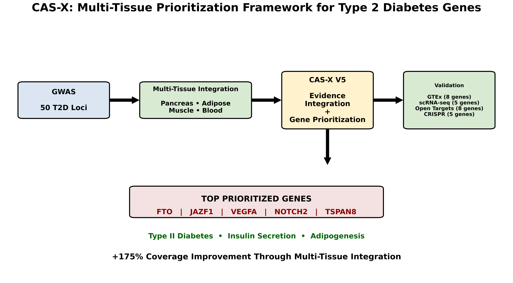

# CAS-X: Multi-Tissue Prioritization Framework for Type 2 Diabetes Susceptibility Genes

## Graphical Abstract



---

## Overview

CAS-X (Candidate Actionability Scoring Framework) is a computational gene-prioritization framework developed to identify and rank candidate Type 2 Diabetes (T2D) susceptibility genes through the integration of genome-wide association study (GWAS) signals, multi-tissue eQTL evidence, transcriptomic validation, pathway enrichment, and external validation resources.

Unlike conventional single-tissue approaches, CAS-X incorporates evidence from multiple biologically relevant tissues involved in T2D pathogenesis, including pancreas, adipose tissue, skeletal muscle, and blood. The framework aims to improve candidate gene prioritization by leveraging complementary sources of functional genomic evidence.

---

## Study Workflow

GWAS Loci → Gene Mapping → GTEx eQTL Integration → Multi-Tissue Evidence Scoring → CAS-X Prioritization → External Validation → Pathway Enrichment

---

## Data Sources

### GWAS Data
- GWAS Catalog Type 2 Diabetes loci

### eQTL Resources
- GTEx v11

### Expression Validation Datasets
- GSE38642
- GSE81608

### External Validation Resources
- Open Targets Platform
- GenomeCRISPR

---

## Key Findings

| Metric | Result |
|----------|----------|
| GWAS loci analyzed | 50 |
| Candidate genes prioritized | 37 |
| Biological tissues integrated | 5 |
| Open Targets validated genes | 8 |
| CRISPR-supported genes | 5 |
| Coverage improvement | +175% |

---

## Multi-Tissue Integration

CAS-X integrates evidence across the following tissues:

- Pancreas
- Adipose Subcutaneous Tissue
- Adipose Visceral Tissue
- Skeletal Muscle
- Whole Blood

This multi-tissue strategy substantially increased candidate gene coverage relative to pancreas-only prioritization approaches.

---

## Top Ranked Genes (CAS-X V5)

| Rank | Gene |
|------|------|
| 1 | FTO |
| 2 | JAZF1 |
| 3 | VEGFA |
| 4 | NOTCH2 |
| 5 | TSPAN8 |

---

## Validation

### Expression Support

Validation was performed using independent transcriptomic datasets:

- GSE38642
- GSE81608 Human Pancreatic Islets

### Open Targets Validation

The following genes were independently supported by Open Targets evidence:

- GCK
- HNF1B
- HNF4A
- KCNJ11
- KCNQ1
- PPARG
- SLC30A8
- TCF7L2

### CRISPR Validation

The following genes showed support from CRISPR-based functional studies:

- FTO
- IRS1
- KCNJ11
- PPARG
- TCF7L2

---

## Pathway Enrichment Analysis

Significant pathways identified from CAS-X prioritized genes include:

| Pathway | Database | Adjusted P-value |
|----------|----------|----------|
| Type II Diabetes Mellitus | WikiPathways | 0.006 |
| Transcription Factor Regulation in Adipogenesis | WikiPathways | 0.006 |
| Galanin Receptor Pathway | WikiPathways | 0.006 |
| Type II Diabetes Mellitus | KEGG | 0.021 |
| Insulin Secretion | KEGG | 0.039 |
| AMPK Signaling Pathway | KEGG | 0.065 |

These results demonstrate enrichment of pathways directly relevant to glucose homeostasis, insulin secretion, adipogenesis, and metabolic regulation.

---

## Repository Structure

```text
CAS_X_T2D/

├── data/
│   ├── raw/
│   └── processed/
│
├── scripts/
│
├── results/
│   ├── tables/
│   └── figures/
│
├── docs/
│
├── README.md
├── requirements.txt
├── LICENSE
└── .gitignore
```

---

## Reproducibility

All analyses were performed using Python-based workflows and publicly available datasets. Scripts required to reproduce the prioritization framework, validation analyses, pathway enrichment analyses, and figure generation are available within the repository.

---

## Author

**Mohd Mehboob Uddin**

Department of Life Sciences  
A.V. College of Arts, Science and Commerce  
Osmania University  
Hyderabad, Telangana, India

---

## Citation

If you use CAS-X in your research, please cite the associated publication when available.

---

## License

This project is distributed under the MIT License.
